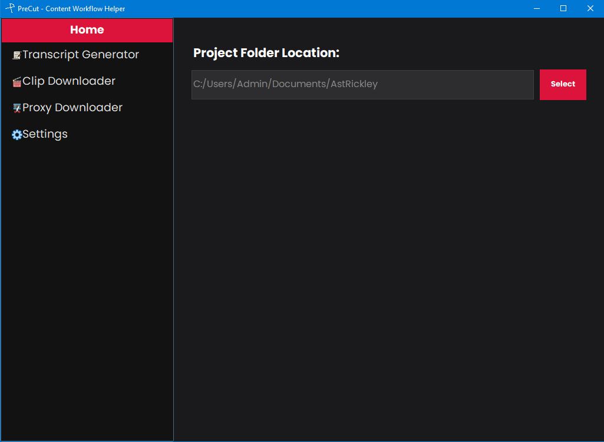
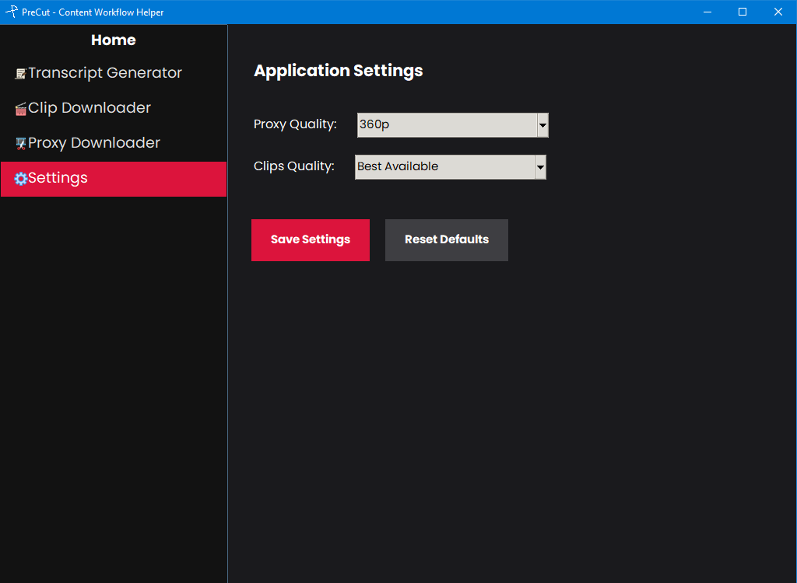
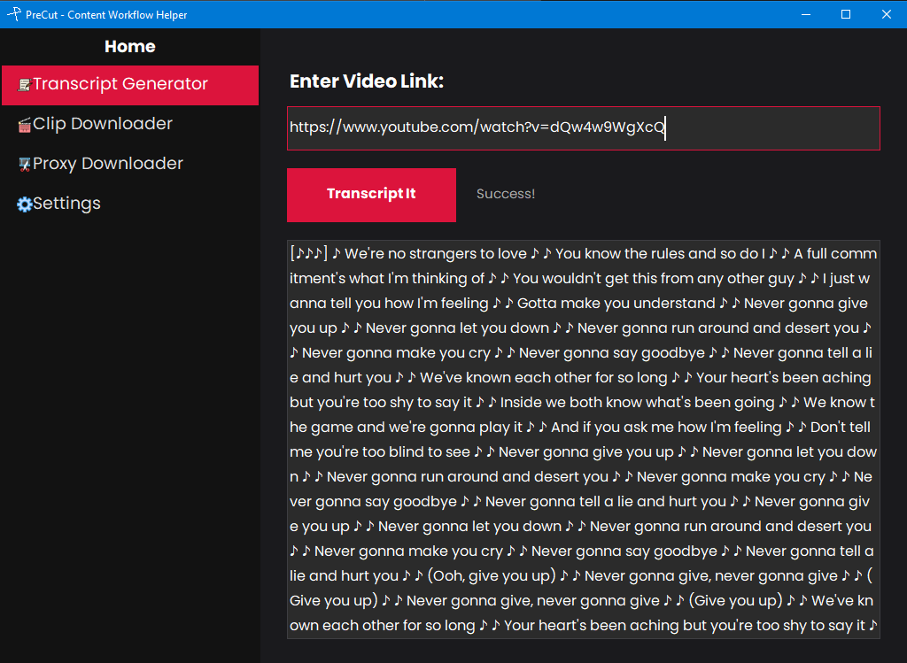
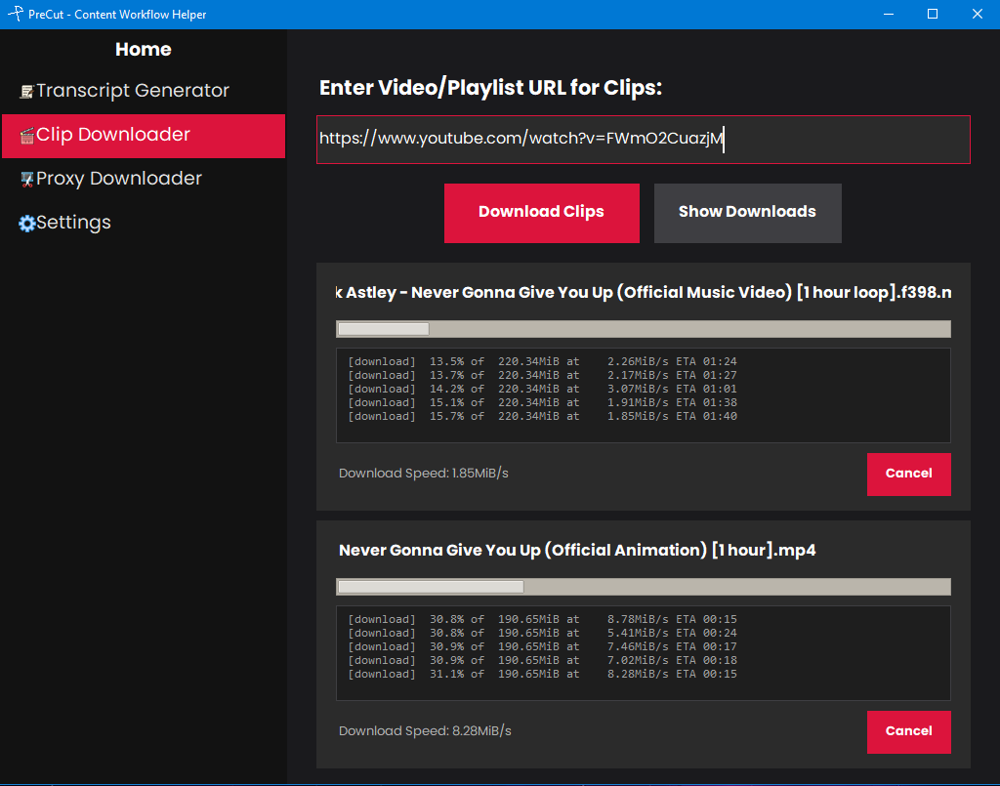
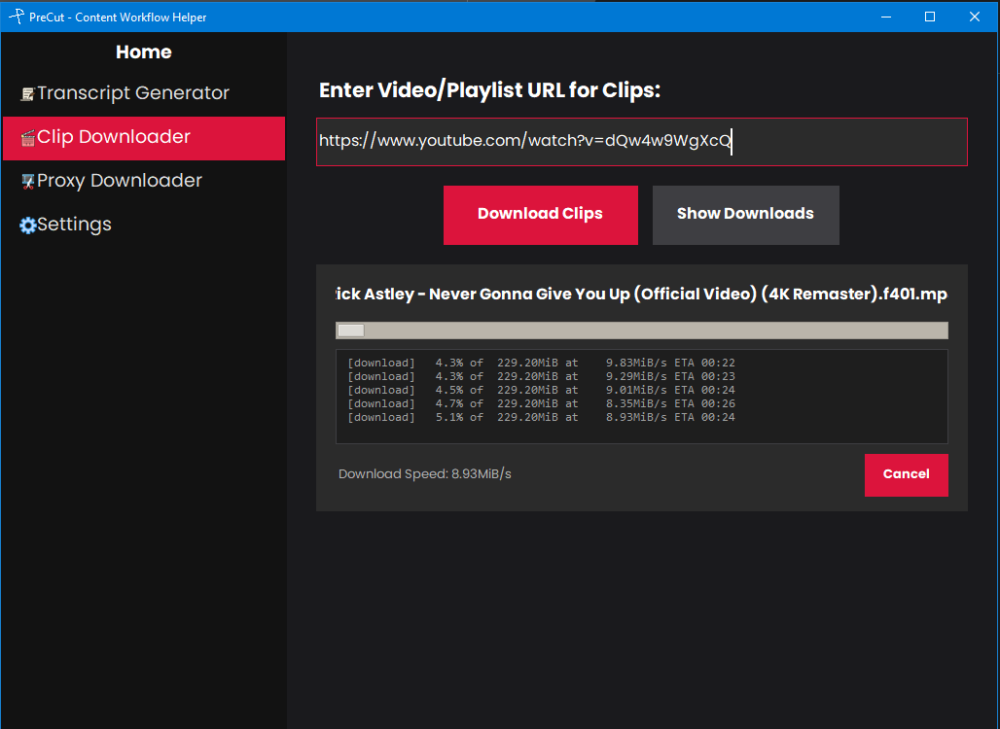
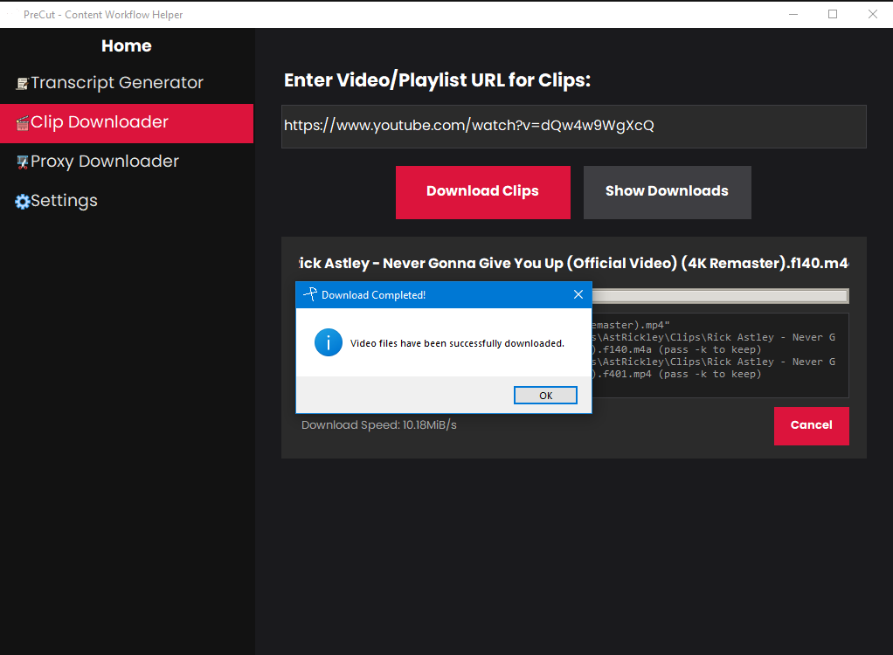
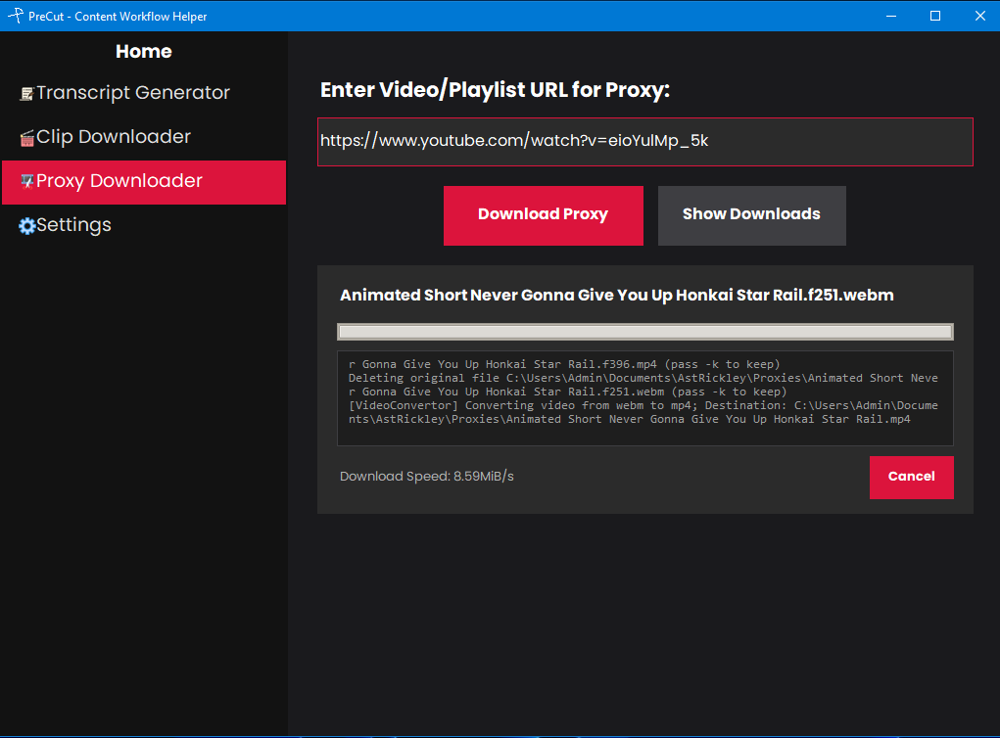
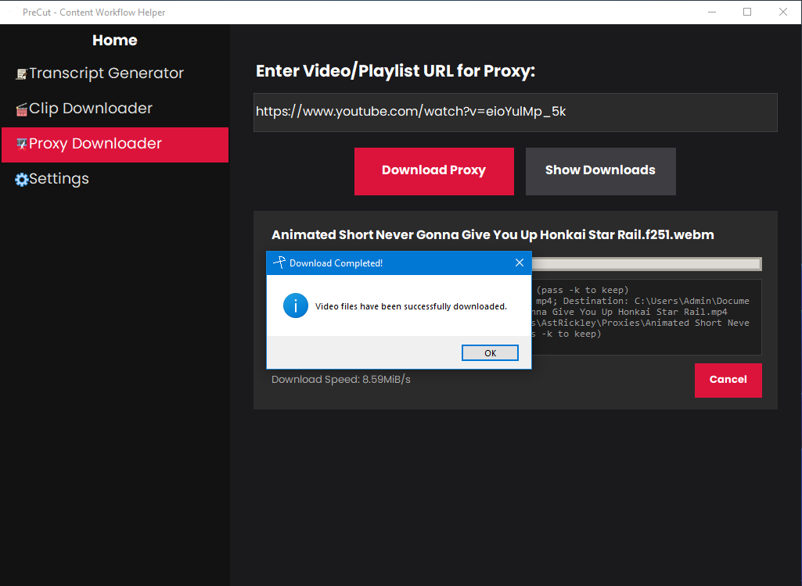

# PreCut - Content Workflow Helper 🎬

A modern, dark-themed desktop application designed to streamline video content creation workflows. **PreCut** provides a centralized interface for generating transcripts, downloading high-quality clips, and managing low-resolution proxies with real-time feedback and smart concurrency management.

> **PreCut v1.1.1** — Proxy downloads now save as `name_Proxy.ext` instead of `name.ext_proxy`, so files keep a valid extension for NLEs and the OS.

---

## ✨ Features

- **📺 Transcript Generator**: Automatically fetch and clean transcripts from online video sources. Strips WebVTT formatting, timestamps, and redundant tags to give you a clean, usable script instantly.
- **📥 Clips Downloader**: Download high-quality video clips directly into your project folders. Features a custom inline terminal log for real-time `yt-dlp` transparency.
- **⚡ Proxy Downloader**: Create lightweight proxies (360p/480p) for faster editing timelines. Files are saved under your project’s `Proxies` folder as `Title_Proxy.ext` (e.g. `MyVideo_Proxy.mp4`).
- **🎬 Codec Selector**: Choose between H.264 (Compatible), AV1 (Efficient), and VP9 (Highest Quality). Defaults to H.264 for perfect compatibility with Adobe Premiere Pro and DaVinci Resolve.
- **⚙️ Persistent Settings & Power User Controls**: Configure global download quality and project paths. Full `yt-dlp` command strings are now stored in your configuration, allowing you to add custom flags manually.
- **🏗️ Smart Concurrency**: Built-in protection allows up to 2 concurrent downloads per page with duplicate URL detection to prevent resource waste.
- **🧹 Clean Workspace**: Automated `__pycache__` relocation and temporary file cleanup to keep your project source code pristine.

---
## 📸 Screenshots

| Page | View |
|:---:|:---:|
|  |  |
| **Project Setup** | **Global Configuration** |
|  |  |
| **Transcript Generation** | **Concurrent Download** |
|  |  |
| **Clip Downloader (Active)** | **Clip Downloader (Completion)** |
|  |  |
| **Proxy Downloader (Active)** | **Proxy Downloader (Completion)** |

---

## 🛠️ Tech Stack

- **UI Framework**: Modernized Python `Tkinter` (Custom Dark Theme)
- **Image Processing**: `Pillow`
- **Backend Engine**: `yt-dlp`
- **Storage**: Persistent JSON-based configuration

---

## 📦 Release & Standalone Version

For users who want to run **PreCut** without installing Python or any libraries, a standalone Windows version is available.

1.  **Download** the latest `PreCut` folder from the [Releases](https://github.com/yourusername/PreCut/releases) page.
2.  **Extract the ZIP** file to a location of your choice.
3.  **Run `PreCut.exe`** directly from the folder.

> [!NOTE]
> As an unsigned binary, Windows Defender may flag the executable on first run. You can safely click "More info" -> "Run anyway" to start the application.

---

## 🚀 Getting Started

### Prerequisites

- **Python 3.10+**
- **yt-dlp**: Ensure `yt-dlp` is installed and accessible in your system's PATH.
- **FFmpeg**: Required for merging high-quality video/audio streams.

> [!IMPORTANT]
> **FFmpeg must be installed and added to your system environment variables (PATH)**. Without it, high-quality downloads and format merging will fail.

### Installation

1. **Clone the repository**:
   ```bash
   git clone https://github.com/yourusername/PreCut.git
   cd PreCut
   ```

2. **Install dependencies**:
   ```bash
   pip install -r requirements.txt
   ```

3. **Run the application**:
   ```bash
   python src/main.py
   ```

---

## 📂 Project Structure

```text
PreCut/
├── assets/             # UI Icons and Brand Assets
├── src/
│   ├── main.py        # Entry point and sidebar navigation
│   ├── page_view.py   # Core UI Components and Logic
│   ├── config.py      # AppConfig and Path Management
│   └── utils.py       # Theme Helpers and Hover Effects
├── requirements.txt    # External dependencies
└── README.md
```

---

## 📝 Configuration

PreCut stores its data outside the source folder to ensure a portable and clean development environment:
- **Settings Path**: `~/Documents/PreCut/data/settings.json`
- **Cache Path**: `~/Documents/PreCut/data/pycache/`

---

## 🤝 Contributing

Contributions are welcome! Feel free to open an issue or submit a pull request for any UI improvements or backend feature additions.

## 📄 License

Distributed under the MIT License. See `LICENSE` for more information.

---

## ⚖️ Legal Disclaimer

### Fair Use Notice
This application is provided for **educational and personal research purposes only**. It is designed to facilitate content creation workflows by allowing users to process and manage video assets they have the legal right to access.

**PreCut** does not encourage or facilitate the unauthorized distribution of copyrighted material. Users are solely responsible for ensuring their use of this tool complies with local laws and the terms of service of any content platforms involved. The developers of PreCut assume no liability for misuse of this software.
